# TraceX

## À propos de TraceX

**TraceX** est un projet de fin de deuxième année de Licence Informatique à l'Université Paris-Cité, campus Saint-Germain-des-Prés.  
Il s'agit d'un logiciel multiplateforme développé en **C++/Qt**, conçu pour faciliter la **gestion et l’extraction de la traçabilité des exigences** à travers différents niveaux de spécifications :  

- **SSS** : Spécification des besoins système ou des parties prenantes  
- **SRS** : Spécification des exigences logicielles  
- **SDD** : Description de la conception logicielle  

Avec TraceX, vous pouvez :  
- Visualiser les relations entre les documents  
- Analyser le taux de traçabilité des exigences  
- Générer des rapports détaillés pour le suivi et la validation des projets logiciels
  
---

## Captures d’écran

<div style="display: flex-wrap: wrap-row;">
  
  
  
</div>

---

## Fonctionnalités principales

- Import et gestion des fichiers SSS, SRS et SDD  
- Graphe interactif des liens de traçabilité  
- Extraction automatique des exigences et styles depuis les documents Word  
- Génération de rapports récapitulatifs  
- Filtres d’exigences  

---

## Installation

La première release officielle est disponible en **fichier ZIP** dans les releases GitHub :  
[https://github.com/Somixe/TraceX/releases/tag/v1.0](https://github.com/Somixe/TraceX/releases/tag/v1.0)

Selon votre OS, installez le fichier correspondant :  

- Windows : `TraceX_Windows.zip`  
- macOS   : `TraceX_Mac.zip`  
- Linux   : `TraceX_Linux.zip`

Après avoir décompressé le fichier ZIP, lancer l'installation du logiciel :  
- Windows : `TraceX_Installer.exe`  
- macOS   : `TraceX_Installer.pkg`
- Linux   : `TraceX_Installer.run`

> Note : Cette version est une bêta stable. Pour modifier ou recompiler le projet, consultez le dossier `src/` et adaptez les chemins si nécessaire (images, fichiers `.ui`, Image.qrc).

> Note : L’installateur macOS n’est pas notarisé par Apple. De ce fait, le bon fonctionnement de l’installateur macOS n’est pas garanti en dehors de la machine de développement.

Après l’installation, pour lancer le logiciel, ouvrez le dossier `TraceX` et exécutez `TraceX.exe` (ou l’équivalent selon votre OS).

---

## Utilisation


Pour voir rapidement comment utiliser TraceX, consultez la **vidéo de démonstration** :  
[Regarder la vidéo](videos/TraceX_demo.mp4)

> Note : Lors de l’utilisation, des messages de permission ou de sécurité peuvent apparaître : merci de les autoriser pour que le logiciel fonctionne correctement.

---

## Documentation

La documentation complète des fonctions et du projet est disponible en ligne via **GitHub Pages** :  
[https://somixe.github.io/TraceX/](https://somixe.github.io/TraceX/)  

---

## Tests et exemples

Le dossier `tests/` contient :  
- `cpp/` et `h/` : fichiers source des tests  
- `examples/` : fichiers SSS, SRS, SDD pour tester le logiciel  
- `CMakeLists.txt` : pour compiler les tests séparément

---

## Notes pour développeurs

- **Code source** : `src/`  
- **Librairies externes** : `external/pugixml-1.15/`  
- **Version C++** : C++17  
- **Version Qt** : Qt 6.x.x  
- **Adaptation des chemins** : si vous modifiez la structure du projet, adaptez les chemins des images, fichiers `.ui` et `Image.qrc`  
- **Compilation** : utiliser CMake (`CMakeLists.txt`) pour générer les fichiers du projet et compiler

---

## Arborescence du projet

### Arborescence textuelle

```text
TraceX/
├── src/
│   ├── cpp/
│   ├── h/
│   ├── ui/
│   ├── Image.qrc
│   └── CMakeLists.txt
├── tests/
│   ├── cpp/
│   ├── h/
│   ├── examples/
│   └── CMakeLists.txt
├── docs/
├── specifications/
│   ├── Cahier_des_charges.pdf
│   ├── Cahier_de_recettes.pdf
│   ├── Conception_generale.pdf
│   ├── Conception_detaillee.pdf
│   ├── Manuel_installation.pdf
│   ├── Manuel_utilisation.pdf
│   ├── Plan_de_tests.pdf
│   └── Rapport_de_projet.pdf
├── assets/
│   └── images/
├── external/
│   └── pugixml-1.15/
├── video/
│   └── TraceX_demo.mp4
├── mockups/
├── .gitignore
└── README.md
```

### Diagramme Mermaid

```mermaid
graph TD
    A[TraceX] --> B[src]
    A --> C[tests]
    A --> D[docs]
    A --> E[specifications]
    A --> F[assets/images]
    A --> G[external/pugixml-1.15]
    A --> H[video/TraceX_demo.mp4]
    A --> I[mockups]
    A --> J[.gitignore]
    A --> K[README.md]

    %% Détail src
    B --> B1[cpp/]
    B --> B2[h/]
    B --> B3[ui/]
    B --> B4[Image.qrc]
    B --> B5[CMakeLists.txt]

    %% Détail tests
    C --> C1[cpp/]
    C --> C2[h/]
    C --> C3[examples/]
    C --> C4[CMakeLists.txt]

    %% Détail specifications
    E --> E1[Cahier_des_charges.pdf]
    E --> E2[Cahier_de_recettes.pdf]
    E --> E3[Conception_generale.pdf]
    E --> E4[Conception_detaillee.pdf]
    E --> E5[Manuel_installation.pdf]
    E --> E6[Manuel_utilisation.pdf]
    E --> E7[Plan_de_tests.pdf]
    E --> E8[Rapport_de_projet.pdf]
```


---

## Équipe

Le projet a été réalisé par : 

- **Maxime Huang** [@Somixe](https://github.com/Somixe)  
- **Jacques Zheng** [@Meitio](https://github.com/Meitio)
- **Abdelmalek Allahoum** [@Malek-Said](https://github.com/Malek-Said)
- **Léa Kim**

Sous la supervision de **Jeremy Meynadier**. 
