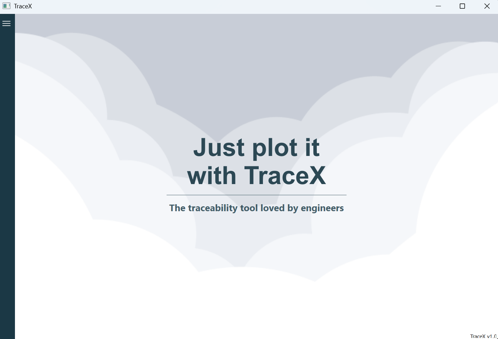
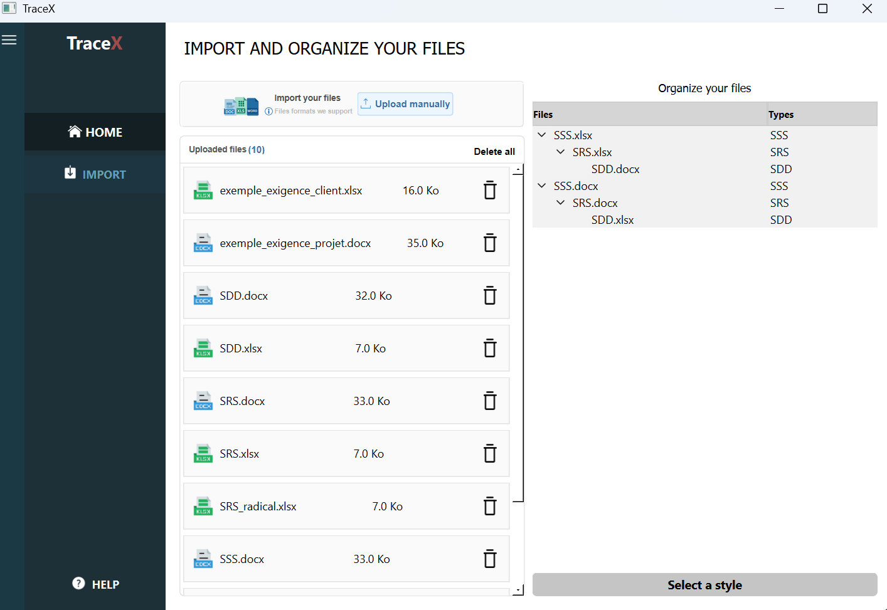
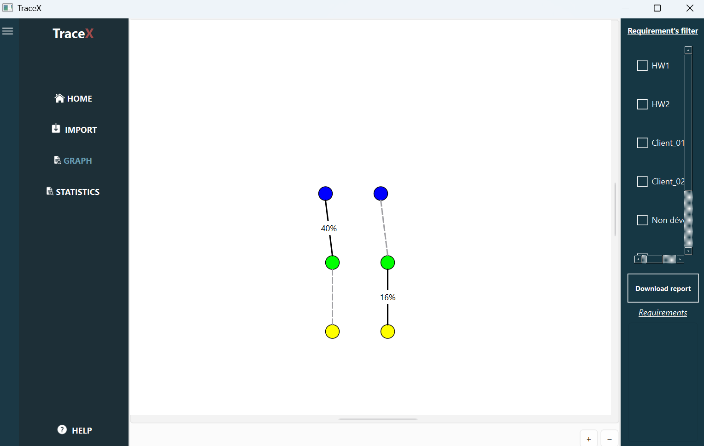

# TraceX

**TraceX** est un logiciel multiplateforme développé en C++/Qt pour la gestion et l’extraction de la traçabilité des exigences (SSS → SRS → SDD).  
Il permet de visualiser les liens entre les documents, analyser le taux de traçabilité et générer des rapports détaillés.

---

## Captures d’écran

<div style="display: flex-wrap: wrap-row;">
  
  
  
</div>

---

## Fonctionnalités principales

- Import et gestion des fichiers SSS, SRS et SDD  
- Graphe interactif des liens de traçabilité  
- Extraction automatique des exigences et styles depuis les documents Word  
- Génération de rapports récapitulatifs  
- Filtres d’exigences  

---

## Installation

La première release officielle est disponible en **fichier ZIP** dans les releases GitHub :  
[https://github.com/Somixe/TraceX/releases/tag/v1.0](https://github.com/Somixe/TraceX/releases/tag/v1.0)

Selon votre OS, installez le fichier correspondant :  

- Windows : `TraceX_Windows.zip`  
- macOS   : `TraceX_Mac.zip`  
- Linux   : `TraceX_Linux.zip`

Après avoir installé ou décompressé le fichier ZIP, rendez-vous dans le dossier `TraceX` puis lancez le logiciel avec :  
- Windows : `TraceX.exe`  
- macOS   : `TraceX.pkg`
- Linux   : `installer.run`

> Note : cette version est une bêta stable. Pour modifier ou recompiler le projet, consultez le dossier `src/` et adaptez les chemins si nécessaire (images, fichiers `.ui`, Image.qrc).

Après l’installation, pour lancer le logiciel, ouvrez le dossier `TraceX` et exécutez `TraceX.exe` (ou l’équivalent selon votre OS).

---

## Utilisation

Lors de l’utilisation, des messages de permission ou de sécurité peuvent apparaître : merci de les autoriser pour que le logiciel fonctionne correctement.

---

## Documentation

La documentation complète des fonctions et du projet est disponible en ligne via **GitHub Pages** :  
[https://somixe.github.io/TraceX/](https://somixe.github.io/TraceX/)  

---

## Tests et exemples

Le dossier `tests/` contient :  
- `cpp/` et `h/` : fichiers source des tests  
- `examples/` : fichiers SSS, SRS, SDD pour tester le logiciel  
- `CMakeLists.txt` : pour compiler les tests séparément

---

## Arborescence du projet 

```
TraceX/
├── src/
│   ├── cpp/
│   ├── h/
│   ├── ui/
│   ├── Image.qrc
│   └── CMakeLists.txt
├── tests/
│   ├── cpp/
│   ├── h/
│   ├── examples/
│   └── CMakeLists.txt
├── docs/
├── specifications/
│   ├── Cahier_des_charges.pdf
│   ├── Cahier_de_recettes.pdf
│   ├── Conception_generale.pdf
│   ├── Conception_detaillee.pdf
│   ├── Manuel_installation.pdf
│   ├── Manuel_utilisation.pdf
│   ├── Plan_de_tests.pdf
│   └── Rapport_de_projet.pdf
├── assets/
│   └── images/
├── external/
│   └── pugixml-1.15/
├── video/
│   └── TraceX_demo.mp4
├── mockups/
├── .gitignore
└── README.md
```

## Équipe

Projet réalisé en collaboration sous la supervision de **Jeremy Meynadier** :  

- **Maxime Huang** [@Somixe](https://github.com/Somixe)  
- **Jacques Zheng**  
- **Abdelmalek Allahoum**  
- **Léa Kim**  
